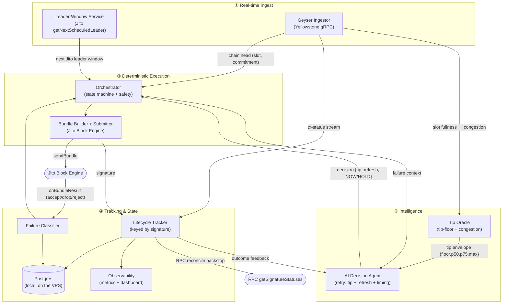

# Marlin — A Smart Transaction Stack for Solana

> Observe the network in real time, submit into the Jito leader window, track every transaction across commitment levels, and let a bounded AI agent own one operational decision per submission — autonomous retry with fault injection.
>
> *Architecture document — Superteam Advanced Infrastructure Challenge: Build a Smart Transaction Stack.*

---

## 1. Overview

On Solana, *sending* a transaction is the easy part. Getting it to **land** reliably is the hard part: you must know which validator is the upcoming Jito leader, submit into that leader's window, pay a competitive but not wasteful tip, then follow the transaction through `processed → confirmed → finalized` while reacting to expiry, drops, and congestion.

**Marlin** is a smart transaction stack that does exactly this:

1. Streams live slot + leader data via **Yellowstone gRPC (Geyser)**.
2. Detects the **Jito leader window** and submits into it.
3. Constructs and submits **Jito bundles** with **dynamically calculated tips** — derived from real recent tip-account data and live network conditions, **never hardcoded**.
4. Tracks each transaction's **full lifecycle** (`submitted → processed → confirmed → finalized`) with timestamps, slot numbers, and latency deltas — **stream-first** for the earliest observation (`processed` arrives on the Geyser tx-stream at PROCESSED commitment), with the authoritative per-signature RPC reconcile (`getSignatureStatuses`) driving `confirmed → finalized`. Commitment is never inferred from slot numbers alone (a slot can finalize on a fork that did not include the transaction).
5. Detects and classifies failures, and **retries automatically** (including blockhash refresh on expiry).
6. Uses an **AI agent to own one autonomous operational decision** — *autonomous retry with fault injection*: when a bundle fails (including a deliberately injected blockhash expiry), the agent **reasons about the cause** and decides what to change before resubmitting — within a deterministic safety envelope.

Runs on **mainnet-beta** (Jito bundles are mainnet-only; real, explorer-verifiable lifecycle logs require it). Payloads are trivial self-transfers under a hard tip cap, so cost stays in cents.

**Design principle:** *the network decides, the AI reasons within bounds, and the signing/submission path stays deterministic and auditable.* The classifier, the mandatory safety actions, and the tip clamp are deterministic code; the AI owns only the discretionary call.

---

## 2. System Architecture



Four layers: **Ingest** (what the network is doing now), **Intelligence** (what tip/timing to use), **Execution** (deterministically build and fire the bundle), and **Tracking** (follow it to finality, classify failures, learn). Canonical sources feed Tracking by responsibility: the **Geyser stream** is canonical for the earliest `processed` observation and chain-head/slot-fullness; the **RPC reconcile** (`getSignatureStatuses`) is canonical for per-signature `confirmed`/`finalized` (commitment is never inferred from slot numbers); and Jito's **`onBundleResult`** is canonical for *bundle acceptance / drop / reject*.

---

## 3. Key Components

Each maps to a real module under `src/`.

### 3.1 Geyser Ingestor — `ingest/geyser.ts`
Subscribes to a Yellowstone/Geyser endpoint and replaces high-latency RPC polling with a push stream:

- **Two independent streams.** Slot updates and filtered transaction status run on **separate subscriptions**, so a chatty tx filter never starves the chain-head signal.
- **Runtime commitment probe → fallback.** Slots start on a single stream (`filterByCommitment:false`); a runtime probe verifies that `confirmed` + `finalized` actually arrive within a window, and if not, **falls back to three per-commitment streams** (one each for processed/confirmed/finalized). `blocksMeta` rides exactly one stream so slot-fullness congestion survives the fallback.
- **Mutable watch set.** `watchSignature()` adds a signature and rewrites the tx subscription in place, minimizing the miss window; an **RPC `getSignatureStatuses` reconcile** backstops the gap before the rewrite applies.
- **Two-lane backpressure.** Chain head is **latest-value-wins**; the watched-tx lifecycle is a **hard-bounded queue** that sheds oldest past a hard cap (with RPC reconcile as the recovery path) so a slow consumer can never exhaust memory.
- **Resilience.** Exponential-backoff reconnect (capped, storm-collapsed into one), keepalive pings on every stream.

### 3.2 Leader-Window Service — `ingest/leaderSchedule.ts`
The submission trigger is the Block Engine's own **`getNextScheduledLeader()`** — the next **Jito-connected** leader, *not* `getLeaderSchedule` (which lists all Solana leaders, most of which can't take bundles). Pure, testable alignment math (`slotsUntilLeader`, `shouldSubmitNow`) combines the next leader slot with the live chain head; the engine waits until the window is within `LEADER_LOOKAHEAD_SLOTS`. The fetch is **throttled** (≤ once / 2 s — the head advances locally between fetches) and **timeout-bounded**, and the wait is hard-capped, so targeting the window can never hang a submission.

### 3.3 Tip Oracle — `tip/tipOracle.ts`
Computes a **dynamic tip envelope with no hardcoded values**:

- Pulls the **Jito tip-floor feed** (`GET /api/v1/bundles/tip_floor`) — landed-tip percentiles, **in SOL** (read element `0`, ×`LAMPORTS_PER_SOL`). 25th → `floor`, 50th → `p50`, 75th → `p75`, 99th → `max`.
- Pulls **`getRecentPrioritizationFees`** + **slot fullness** (from blockMeta) → a 0–1 **congestion score** (an *advisory* signal handed to the agent — never a tip multiplier).
- **Degraded fallback:** if the feed is unreachable, reuse the last-good distribution **capped at p50**, tagged `last_good_degraded`. Fails closed (never invents a tip) if there is no feed *and* no last-good.
- Every lamport value is minted through a **branded `TipLamports`** type whose only constructors live in `tip/tipLamports.ts` — a hardcoded number literal **cannot** reach the executable tip path.

### 3.4 AI Decision Agent — `ai/agent.ts`  *(the one autonomous decision)*
On a failure, the agent makes **one bounded operational decision**: the new tip, whether to refresh the blockhash, and whether to submit **NOW** or **HOLD one window**. Detailed in §6. Real LLM reasoning via **OpenRouter** (OpenAI-compatible); the call is injected, so the whole module is unit-testable offline.

### 3.5 Bundle Builder + Submitter — `exec/bundle.ts`
**Deterministic — no AI in this path.** Builds a **v0** self-transfer payload (compute-unit limit + price + transfer), assembles a **Jito bundle** (`jito-ts`) = payload + a **tip-transfer** to a real Jito tip account, signs, and submits via the **Block Engine** (`sendBundle`). The chosen tip is a `TipLamports`, so a hardcoded value can't reach `addTipTx`. `onBundleResult` is mapped into a narrowed `JitoSignal` (`accepted / processed / finalized / dropped / rejected / unknown`) for the classifier.

### 3.6 Lifecycle Tracker — `track/lifecycle.ts`
A pure, **monotonic** stage machine (`submitted → processed → confirmed → finalized`) **keyed by transaction signature** — exactly what the Geyser tx-stream and RPC `getSignatureStatuses` carry. Records per stage: timestamp, slot, and **latency delta** from the previous stage. Fed by the **Geyser tx-stream (fast path)** and a **repeating RPC reconcile (authoritative, drives finalization)**. A `signature → attemptId` map translates every event to a DB attempt id before persisting, so a lifecycle row is never written without its parent.

### 3.7 Failure Classifier — `track/failures.ts`
Deterministic, **dual-canonical** (Geyser commitment + Jito `onBundleResult`), priority-ordered. See §7.

### 3.8 Orchestrator — `exec/orchestrator.ts`
The per-submission **state machine**. Enforces the deterministic/AI split: on failure it applies the **mandatory safety action** (expiry → refresh) in code, then consults the agent for the **discretionary** tip/timing. Bounds retries (`MAX_RETRIES`) and holds (`MAX_HOLD_WINDOWS`). All effects (submit, tip oracle, the LLM, window waits) are injected → fully unit-testable.

### 3.9 Fault Injection — `faultInjection.ts`
For the AI demo: captures a blockhash, then **waits until it is provably expired** (`currentBlockHeight > lastValidBlockHeight` — block height, not slot), submits the stale bundle, and classifies `ExpiredBlockhash` **deterministically**. The **proof** (`last_valid_block_height` + the observed `expiry_block_height`) is persisted on the attempt — explorer-consistent, never fabricated. If the hash doesn't expire in the window, it does **not** fake it (falls back to a fresh submission).

### 3.10 Persistence — `db/` (local Postgres on the VPS)
Async, never on the submission path. **Deterministic UUIDs** (derived from each row's natural key) + **idempotent upserts** (`ON CONFLICT`) make WAL replay safe and keep foreign keys valid. A `WriteBuffer` flushes to Postgres with a **JSONL write-ahead-log** fallback (no-loss: peek-don't-drop, fatal-pending guard, corrupt-line preservation). Tables: `submissions`, `submission_attempts`, `lifecycle_events`, `tip_decisions`, `failures`, `agent_decisions`, and an **append-only `bundle_events`** history (one row per attempt × kind, so the full accept→process→finalize/drop progression is preserved, not collapsed into one snapshot).

### 3.11 Observability — `obs/metrics.ts` + dashboard (`index.ts`)
Metrics: **land rate**, time-to-confirm / time-to-finalize percentiles, **tip efficiency** (paid vs. minimum landed tip). A small read dashboard + `/health`. The deliverable lifecycle log is exported from the DB by `scripts/runBatch.ts` (`lifecycle-report.json` + `.md`).

---

## 4. Data Flow

```mermaid
sequenceDiagram
    participant O as Orchestrator
    participant L as Leader Service
    participant T as Tip Oracle
    participant A as AI Agent
    participant B as Bundle Builder
    participant J as Jito Block Engine
    participant K as Lifecycle Tracker
    participant D as Postgres

    O->>T: initial tip distribution
    T-->>O: envelope {floor,p50,p75,max,congestion}
    loop each attempt (bounded by MAX_RETRIES)
        O->>L: in the Jito leader window?
        L-->>O: wait until within lookahead, then go
        O->>B: build + submit(tx, tip)
        B->>J: sendBundle(bundle)
        J-->>K: signature (track by signature)
        K->>D: persist(submitted)
        K-->>K: processed (from stream) → confirmed → finalized (from RPC reconcile)
        K->>D: persist(each stage + slot + ts + latency)
        alt finalized
            O-->>O: success
        else failure (e.g. injected blockhash expiry)
            J-->>O: classify(failure) [Geyser ∨ onBundleResult]
            O->>O: mandatory safety (expired → refresh)
            O->>T: refreshed tip distribution
            O->>A: decide(failure, tips, leader window)
            A-->>O: {refresh_blockhash, new_tip_lamports, NOW|HOLD}
            O->>O: clamp tip to [floor, cap]; combine refresh; loop
            O->>D: persist(agent_decision + failure + bundle_events)
        end
    end
```

---

## 5. Infrastructure Decisions

| Decision | Choice | Why |
|---|---|---|
| Language / runtime | **TypeScript / Node (ESM, strict)** | Mature Solana SDKs (`@solana/web3.js`, `jito-ts`, Yellowstone client); the whole decision/safety surface is unit-testable. |
| Chain data | **Yellowstone gRPC (Geyser)** via **SolInfra** (primary + fallback) | Push streaming of slots + tx status beats RPC polling on latency and rate limits — essential for hitting leader windows and stream-confirming landing. |
| Leader trigger | **Jito `getNextScheduledLeader()`** | Bundles only land if the **Jito-connected** leader produces the slot; the full `getLeaderSchedule` would target leaders that can't take bundles. |
| Bundle submission | **Jito Block Engine + `jito-ts`** | Atomic, tip-prioritized inclusion; `onBundleResult` gives first-class accept/drop/reject evidence. |
| Tip calculation | **Jito tip-floor feed + `getRecentPrioritizationFees`** | Requirement: no hardcoded tips. Tips track the real-time landed-tip distribution + congestion. |
| AI decision | **LLM via OpenRouter** (OpenAI-compatible) | One bounded reasoning step over structured signals; OpenRouter is cheap and lets us swap models freely at this cadence. |
| Compute | **VPS, always-on (pm2/systemd)** | The engine holds a persistent Geyser gRPC stream and must react within ~400 ms slots — serverless cannot hold the stream. |
| Persistence | **Postgres on the same VPS** | Colocated → low write latency, one fewer dependency, no serverless connection limits. Writes are async, never on the submission path. |
| Network | **Mainnet-beta** | Jito bundles don't exist on devnet; real, explorer-verifiable lifecycle logs require mainnet. Tiny payloads + a hard tip cap keep cost in cents. |
| Region *(deployment)* | **Run the VPS + submit in the Jito region nearest the target leader** | Shaves propagation latency into the leader window — a real determinant of land rate. *(A deployment-time choice, documented per the brief.)* |

---

## 6. AI Agent Responsibilities — Autonomous Retry with Fault Injection

The agent owns **one real operational decision**: when a bundle fails, it *reasons* about why and decides what to change before resubmitting — autonomously, with visible rationale, inside a deterministic envelope. This is genuine reasoning, not a hardcoded retry flow.

**Trigger.** A fault is injected (`faultInjection.ts` submits a provably-expired blockhash) or a real failure occurs. The stack detects + classifies it (§7), applies the mandatory safety action in code, then hands the failure context to the agent.

**Inputs (all live, structured):** failure classification; the live tip envelope (`floor / p50 / p75 / max`) + congestion score; the imminent-vs-next Jito leader-window label; attempt number vs. max retries.

**Decision (structured output, validated at runtime):**
```json
{
  "diagnosis": "Blockhash expired against the ~150-block validity window; the bundle missed its leader window.",
  "actions": { "refresh_blockhash": true, "new_tip_lamports": 38000, "submit": "NOW" },
  "confidence": 0.81,
  "rationale": "Congestion moderate; a fresh blockhash restores full validity and a p60 tip beats the live floor; current leader is strong, so fire now."
}
```
Obtained via **forced function-calling** (`decide_retry` tool), with a strict **`json_schema` response-format fallback** if the model won't emit a tool call.

**The deterministic / AI boundary — what the AI does *not* do:**
- The **classifier** is deterministic. The **mandatory safety** (`ExpiredBlockhash → refresh`) is applied in the orchestrator regardless of the model.
- `new_tip_lamports` is **clamped** to `[oracle.floor, TIP_HARD_CAP_LAMPORTS]` — the AI chooses *within* a market-derived, capped envelope and can never invent or exceed the cap. The clamp is the **only** path from a model number to an executable tip.
- `HOLD` is bounded by `MAX_HOLD_WINDOWS`; retries by `MAX_RETRIES`.
- The agent **never signs or submits**. A **malformed** model output is never dressed up as an "AI retry": it is recorded as malformed, and the next attempt is a deterministic safety-only retry at the oracle p50 — only a later *valid* decision counts as a real AI retry.
- Every decision (inputs + output + rationale) is **persisted** to `agent_decisions` and shown on the dashboard.

> **Bounded autonomy:** the AI makes a genuine, reasoned call that affects cost and success, but sits outside the critical signing/submission path and inside deterministic guardrails. A bad model output degrades efficiency, never safety.

---

## 7. Failure Handling Strategy

```mermaid
stateDiagram-v2
    [*] --> Submitting
    Submitting --> Tracking: bundle sent
    Tracking --> Finalized: finalized (stream/RPC)
    Tracking --> Observed: on-chain but not finalized in window
    Tracking --> Classify: not landed / dropped / rejected
    Classify --> Refresh: ExpiredBlockhash (mandatory)
    Classify --> Decide: other classes
    Refresh --> Decide
    Decide --> Submitting: AI tip/timing (clamped); HOLD bounded
    Decide --> Failed: max retries / max holds
    Finalized --> [*]
    Observed --> [*]
    Failed --> [*]
```



**Terminal states.** `Finalized` (landed). `Observed` — the tx reached the chain (`processed`/`confirmed`) but finalization wasn't seen inside the window: **terminal, not retried** (retrying would double-send a tx that can still finalize) and **not reported as finalized** (honest about the lifecycle). `Failed` — never observed on-chain, after bounded retries.

**Transaction failure classification** (`track/failures.ts`) — priority-ordered; every non-landing is classified, persisted with its raw evidence, and (for the AI path) handed to the agent:

| Class | Signal | Response |
|---|---|---|
| **ExpiredBlockhash** | block-height proof, `BlockhashNotFound`, or Jito `dropped.BlockhashExpired` | **Mandatory deterministic refresh**, then AI recomputes the tip; resubmit. |
| **ComputeExceeded** | CU limit hit in simulation/landing | Surfaced to the agent; (CU re-budget is a documented Phase-2 mandatory action). |
| **FeeTooLow** | **only** with explicit tip-below-live-floor evidence **and** a non-landing Jito outcome | Agent recomputes the tip from the current distribution; resubmit. |
| **BundleFailure** | anything else (unknown reject, `dropped.NotFinalized/PartiallyProcessed`, leader skip, no-land) | Raw Jito result persisted for audit; resubmit into the next Jito leader window with a fresh blockhash. |

`FeeTooLow` is **deliberately narrow**: a drop/reject does *not* automatically mean the fee was too low (it could be a bad tx, invalid tip account, sim failure, or auth issue), so we only assert it with explicit floor evidence and otherwise fall through to `BundleFailure` with the raw result kept.

**Infrastructure-level handling:**

| Failure | Handling |
|---|---|
| Geyser stream drops | Exponential-backoff reconnect + resubscribe; the watched-tx queue degrades gracefully and the RPC reconcile bridges the gap. |
| Single slot stream never yields confirmed/finalized | Runtime probe → fall back to three per-commitment slot streams. |
| Bundle result races registration | Results that arrive before the attempt is wired up are **buffered and drained** at registration — no evidence lost, no terminal drop degraded into a timeout. |
| Tip feed stale / unavailable | Last-good distribution, flagged `degraded`; agent capped at ≤ p50 until fresh data returns. |
| DB write failure | Async `WriteBuffer` → JSONL WAL; submission never blocks on persistence; replay is idempotent. |
| Duplicate intent | Deterministic ids + idempotency keys make re-records and WAL replay converge on the same rows. |

---

## 8. Observability

- **Metrics:** land rate, p50/p95 time-to-confirm and time-to-finalize, tip efficiency (paid vs. minimum landed tip), retries/submission, stream health, agent HOLD rate.
- **Logs:** structured per-submission trace (decision → submit → each lifecycle stage with slot + timestamp).
- **Lifecycle log:** `scripts/runBatch.ts` exports the persisted run as `lifecycle-report.json` + a human-readable `lifecycle-report.md` — slots, commitment progression, timestamps, tips, failure classes, and Solscan links for landed txs (the judged deliverable).

---

## 9. Tech Stack

`TypeScript` (Node, ESM, strict) · `@solana/web3.js` · `@triton-one/yellowstone-grpc` (Geyser client) · `jito-ts` (Block Engine bundles) · `OpenRouter` (agent LLM, OpenAI-compatible) · `pg` / Postgres (local, on the VPS) · `express` + `pino` · **SolInfra** (RPC + Yellowstone gRPC, primary + fallback).

---

## 10. Why This Is Production-Minded
- **Hits every requirement** explicitly: Geyser streaming with reconnect + backpressure, Jito leader-window detection, real Jito bundles, dynamic (non-hardcoded, branded) tips, full lifecycle tracking (stream-first for `processed`, RPC-canonical for `confirmed`/`finalized` — never slot-inferred), narrow failure classification, automatic retry with blockhash refresh, and one genuinely autonomous AI decision.
- **No happy-path shortcuts:** an injected expiry with explorer-consistent proof, an `observed` terminal that refuses to double-send or overclaim finalization, append-only bundle-result evidence, and idempotent no-loss persistence.
- **Bounded-autonomy AI:** a real, auditable operational decision that never compromises the deterministic signing/submission path.
