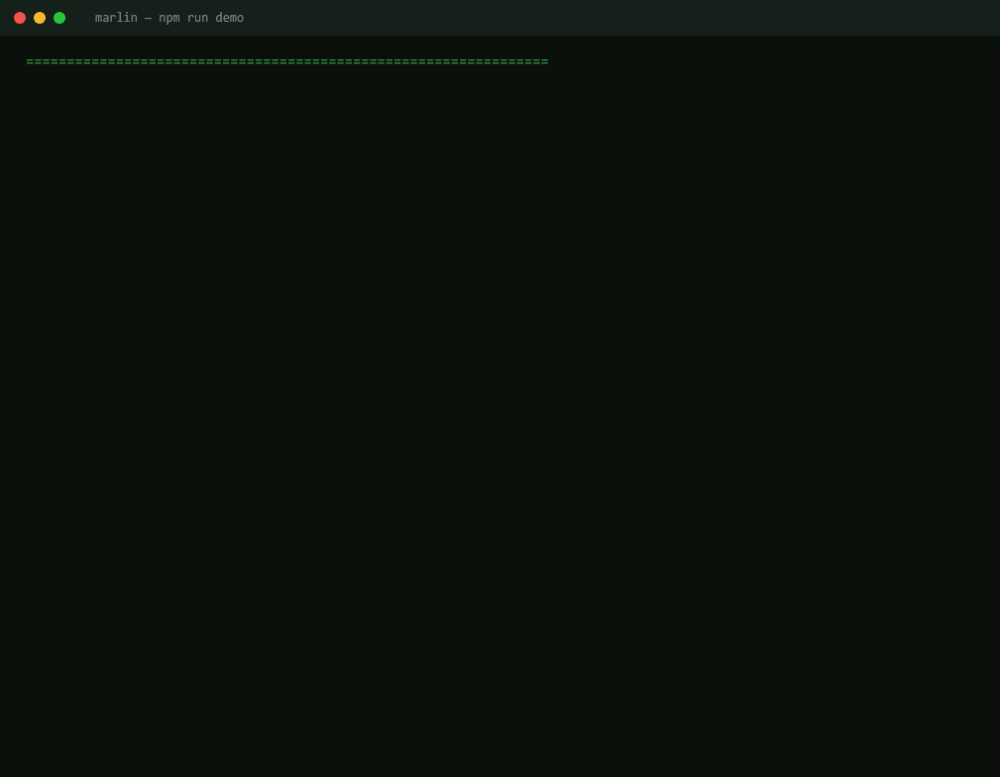

# Marlin — a smart transaction stack for Solana

Streams live slot + leader data over **Yellowstone gRPC (Geyser)**, submits **real Jito bundles** on **mainnet-beta** with **dynamically computed tips** (no hardcoded values, ever), tracks each transaction's full lifecycle (`submitted → processed → confirmed → finalized`) — **stream-first** for the earliest `processed` observation, with an authoritative per-signature RPC reconcile driving `confirmed → finalized` (commitment is never inferred from slot numbers alone) — classifies failures and retries automatically, and lets one bounded **AI agent** own a single operational decision — *Autonomous Retry with Fault Injection* — within a deterministic safety envelope.



*`npm run demo` runs the real engine end to end with no RPC, wallet, or API key. Only the network boundary is faked.*

See `Architecture.md` for the system design; `CLAUDE_CODE_BUILD_BRIEF.md` for the build spec.

## What sets this apart

Most "transaction stacks" are a checklist of builders and helpers. Marlin goes deep on the parts that actually decide whether a transaction lands, and proves each one:

- **Real-time network awareness, not just sending.** Live Yellowstone gRPC (Geyser) streaming of slots and leaders, with submission targeted into the **Jito leader window** (`getNextScheduledLeader` plus window math), because a bundle only lands if the scheduled Jito leader produces that block.
- **Dynamic tips, never hardcoded.** Tips come from the live Jito tip-floor plus network congestion, and a raw model number can become an executable tip only through one clamped mint path (a branded `TipLamports`), bounded by a hard cap.
- **Fork-safe finalization.** `processed` is observed from the stream for the earliest timestamp, but `confirmed` and `finalized` come only from the authoritative per-signature RPC reconcile. Commitment is never inferred from a slot number, so a transaction is never reported finalized off a fork it did not land on.
- **One bounded, auditable AI decision.** When a bundle fails (including a deliberately injected blockhash expiry), the agent reasons about the cause and chooses the tip and retry timing inside a deterministic safety envelope: the classifier and the mandatory blockhash refresh are code, the AI owns only the discretionary call, and a malformed AI response degrades to a safe deterministic retry.
- **Proof, not promises.** 76 offline tests cover the entire decision and safety surface, and `npm run demo` runs the real engine end to end on in-memory fakes (no RPC, no wallet, no key) so the whole leader-window to AI-retry to finalized story plays out in your terminal in seconds.

> **Try it in 5 seconds, zero setup:** `npm install && npm run demo`

## Setup

```bash
npm install              # dedupes @solana/web3.js to a single version (see package.json overrides)
npm run typecheck        # tsc --noEmit
npm test                 # node:test via tsx — the entire decision/safety surface, unit-tested offline
npm run demo             # NO CREDS: watch the whole engine run (leader window → tip → injected expiry
                         #           → AI retry → finalized) on in-memory fakes in your terminal
cp .env.example .env     # fill in SolInfra RPC+Geyser, a funded mainnet payer, OpenRouter key
npm run db:init          # apply the schema to local Postgres
npm run dev              # start the engine + read dashboard
```

**No creds? See it work anyway.** `npm test` verifies the entire decision/safety surface offline (76 tests), and `npm run demo` runs the *real* engine path end-to-end on in-memory fakes — only the network boundary (RPC/Jito/Geyser/Postgres/LLM) is stubbed. The live run (`npm run run:batch`) needs the creds above plus a host that holds the persistent gRPC stream.

## Live mainnet run

`scripts/runBatch.ts` was executed against **mainnet-beta**: **10 real submissions, 37 attempts** through the full pipeline (see `lifecycle-report.md`, included unedited). Every layer ran live — Geyser streaming, **dynamic tips from the live Jito tip-floor** (6.38× floor, n=68), failure classification, the **bounded AI retry**, and the **forced blockhash-expiry**.

**Land rate was 0%, and the log reports it plainly — no cherry-picking.** Tips were not the cause: they ran 6.38× the floor, and even a max-cap **200,000-lamport** tip (≈150× the floor) did not land. The bundles did not reach a producing Jito leader through the **free, keyless public block engine** (1 req/s rate limit, no authenticated leader access). Reliable landing requires an **authenticated Jito searcher keypair**, which this run did not have. The log is published as honest evidence that the stack runs end-to-end on real infrastructure and exercises its complete failure-handling path under live conditions.

## Verification gates

- `npm ls @solana/web3.js` must show exactly one version (the jito-ts double-copy hazard).
- `npx tsx scripts/agentSmoke.ts` must pass before any mainnet demo (proves the model returns a schema-valid decision).

## The three required questions

> The conceptual answers are complete here. Each `〔observed: …〕` slot is filled from a real run via `scripts/runBatch.ts` → `lifecycle-report.md`; judges can cross-reference the slot numbers on Solscan.

**Q1 — What does the delta between `processed_at` and `confirmed_at` tell you about network health?**

The two stages mean different things. `processed` = a node has *executed* your transaction in a block at the chain tip — optimistic, single-block, and still droppable on a fork. `confirmed` = a **supermajority of stake (≥⅔) has voted on that block** (optimistic confirmation). So the delta measures **how long the cluster took to gather supermajority votes on the exact block your transaction landed in** — i.e. **vote-propagation latency and fork contention at that instant.**

- **Small and stable** (sub-second, ~1–2 slots): healthy — fast vote propagation, low fork rate, the tip of chain is converging quickly.
- **Large or growing**: stress — vote propagation is lagging, or competing forks are delaying which block earns the supermajority, or the cluster is congested.

It's a more *sensitive* health gauge than land-rate alone, because it widens **before** outright failures start — a growing processed→confirmed delta during a run is an early warning to escalate tips and widen retry windows. 〔observed: p50/p95 processed→confirmed deltas under calm vs. busy conditions, from `lifecycle-report.md`〕

**Q2 — Why should you never use a `finalized` blockhash for a time-sensitive transaction?**

A blockhash is valid for only **150 blocks** (~60–80 s), checked against `lastValidBlockHeight` — which is a **block height, not a slot** (blocks can be skipped, so height ≤ slot). A `finalized` blockhash is already **~31+ slots behind the chain tip** (finalization = rooted, ≥32 confirmations deep), so you begin life having **already burned roughly a third of the 150-block window** before you even submit. The transaction therefore ages out far sooner, expiry risk spikes, and — worst of all — under congestion, exactly when you need the full window for retries, you have the **least** runway. Use a **recent (`processed`/`confirmed`) blockhash** to maximize usable validity; the only trade is a small chance the recent block forks away, which a retry re-fetch handles anyway.

This is precisely the failure we **deliberately inject** (`faultInjection.ts`): capture a blockhash, wait until block height passes `lastValidBlockHeight`, submit → a provable `ExpiredBlockhash`, which the agent then reasons about and refreshes. 〔observed: the forced-expiry attempt's captured `last_valid_block_height` and the `expiry_block_height` that exceeded it〕

**Q3 — What happens to your bundle if the Jito leader skips their slot?**

A Jito bundle is **atomic** and only lands if the **specific Jito leader scheduled for that slot actually produces the block**. If that leader **skips** their slot, **no block is produced for it, so the bundle is simply not included** — and because the bundle is all-or-nothing, there is **no partial execution**: nothing happens, no fee, and **no tip is charged** (the tip only pays on inclusion). The bundle does **not** automatically roll to the next leader — it targeted *that* window, and that window is gone.

Marlin handles this exactly as a non-landing: the lifecycle tracker never reaches `processed`/`finalized` (and `onBundleResult` may report a drop), so it's classified (`BundleFailure`, or `ExpiredBlockhash` if the hash also aged out) and **resubmitted into the next Jito leader window with a fresh blockhash and a recomputed tip**, bounded by max retries. Because nothing executed, resubmission is safe — there is no double-spend risk. 〔observed: a real skipped-window instance from the logs, if caught during the run〕
